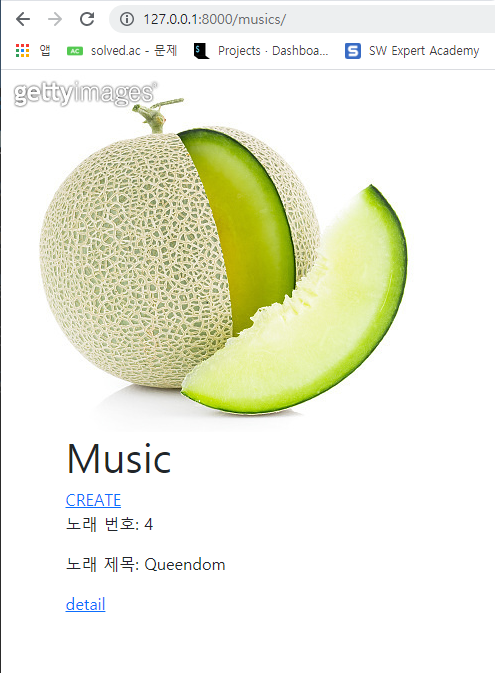
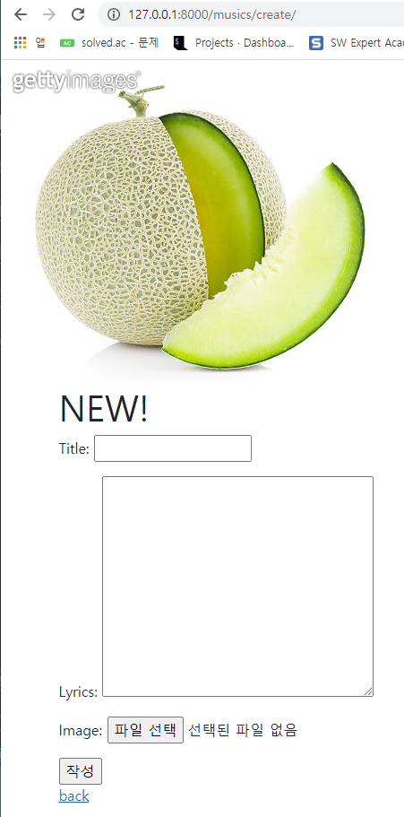
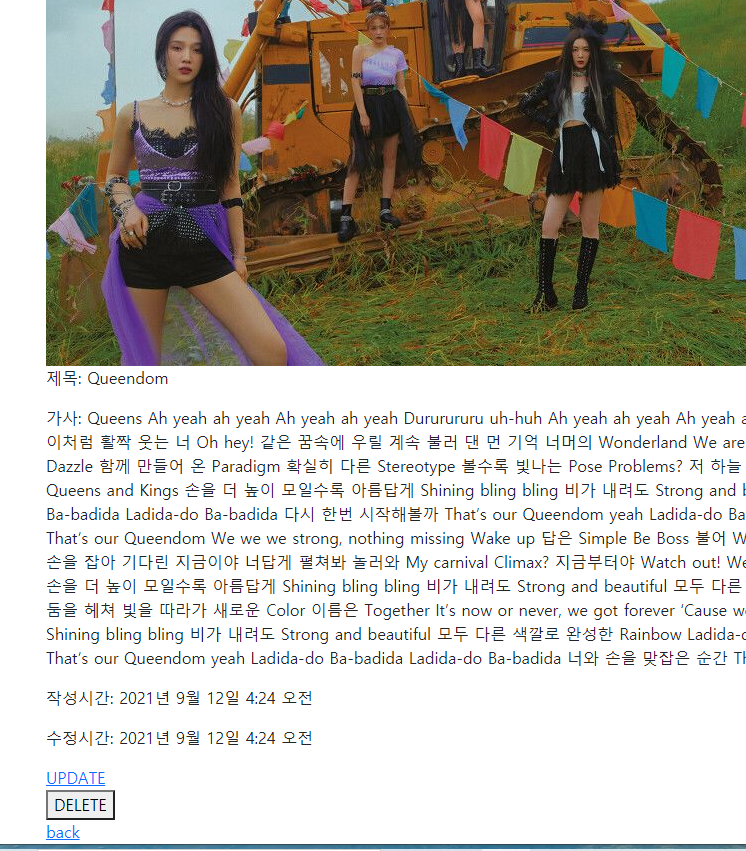

# 210909 workshop

프로젝트 이름 : crud

앱 이름 : musics

설명 : 평소 공부하는 시간을 빼고는 항상 음악을 듣는 나는 음악 웹사이트인 melon 을 모방하고 싶었다. 내가 좋아하는 노래와 노래가사, 앨범커버를 올리는 웹사이트를 만들어봤다.









```python
# musics/templates/musics/detail.html





  <h2>DETAIL</h2>
  <h3>{{ music.pk }}번째 song</h3>
  
  <p>제목: {{ music.title }}</p>
  <p>가사: {{ music.lyrics }}</p>
  <p>작성시간: {{ music.created_at }}</p>
  <p>수정시간: {{ music.updated_at }}</p>
  <a href="">UPDATE</a>
  <form action="" method="POST">
    
    <button>DELETE</button>
  </form>
  <a href="">back</a>

```

```python
# settings.py

STATIC_URL = '/static/'

STATICFILES_DIRS = [
    BASE_DIR / 'static',
]

MEDIA_ROOT = BASE_DIR / 'media'

MEDIA_URL = '/media/'

# 을 추가하였다.
```

```python
# musics/models.py

from django.db import models

class Music(models.Model):
    title = models.CharField(max_length=30)
    lyrics = models.TextField()
    image = models.ImageField(upload_to='images/', blank=True) # 추가
    created_at = models.DateTimeField(auto_now_add=True)
    updated_at = models.DateTimeField(auto_now=True)

    def __str__(self):
        return self.title  
```

