# DB M:N 관계

### Model relationship 2

* Intro
  * 병원 진료 기록 시스템
* ManyToManyField
  * 좋아요 기능 (Like)
  * Profile Page
  * 팔로우 기능 (Follow)

---

### Intro 병원 진료 기록 시스템

### 1:N의 한계

* 새로운 예약을 생성하는 것이 불가능
  * 새로운 객체를 생성해야 함
* 여러 의사에게 진료 받은 기록을 환자 한 명에 저장할 수 없음
  * 외래 키에 '1, 2' 형식의 데이터를 사용 할 수 없음

> 중개 모델

* 중개 모델(혹은 중개 테이블, Associative Table) 작성

```python
# hospitals/models.py

from django.db import models

class Doctor(models.Model):
    name = models.TextField()

    def __str__(self):
        return f'{self.pk}번 의사 {self.name}'

class Patient(models.Model):
    doctors = models.ManyToManyField(Doctor, through='Reservation')
    name = models.TextField()

    def __str__(self):
        return f'{self.pk}번 환자 {self.name}'

class Reservation(models.Model):
    doctor = models.ForeignKey(Doctor, on_delete=models.CASCADE)
    patient = models.ForeignKey(Patient, on_delete=models.CASCADE)
    symptom = models.TextField()
    reserved_at = models.DateTimeField(auto_now_add=True)

    def __str__(self):
        return f'{self.doctor.pk}번 의사의 {self.patient.pk}번 환자'
```

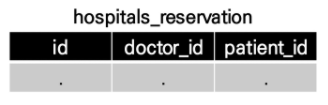

* 데이터베이스 초기화 / 마이그레이션 및 shell_plus 실행

```python
$ python manage.py makemigrations
$ python manage.py migrate

$ python manage.py shell_plus
```

* 중개 모델과의 모델 관계 확인

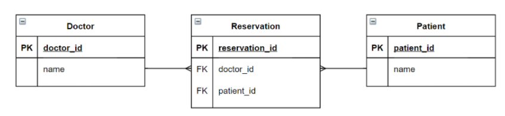

* 의사 1명과 환자 1명 생성 및 예약 생성

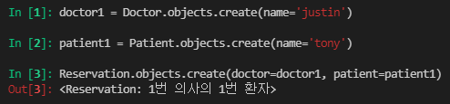

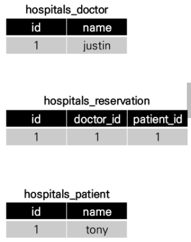

* 예약 내역 조회
* 의사의 예약 환자 조회

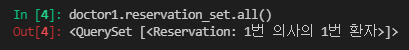

* 환자의 담당 의사 조회

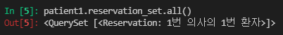

* 환자 1명 추가 생성 및 1번 의사에게 예약 생성

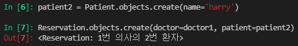

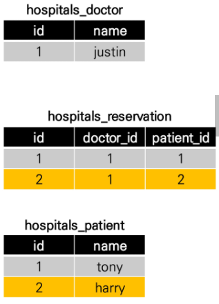

* 의사의 예약 환자 조회

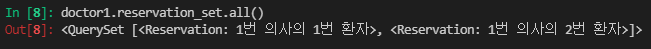

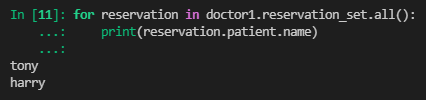

#### ManyToManyField

* 다대다 (M:N, many-to-many) 관계 설정 시 사용하는 모델 필드
* 하나의 필수 위치인자(M:N 관계로 설정할 모델 클래스)가 필요

* ManyToManyField 작성 (중개 모델 삭제)
  * 필드 작성 위치는 Doctor 또는 Patient 모두 작성 가능

```python
# hospitals/models.py

class Doctor(models.Model):
    name = models.TextField()

    def __str__(self):
        return f'{self.pk}번 의사 {self.name}'

class Patient(models.Model):
    doctors = models.ManyToManyField(Doctor, through='Reservation')
    name = models.TextField()

    def __str__(self):
        return f'{self.pk}번 환자 {self.name}'
```

* 데이터베이스 초기화 / 마이그레이션 및 shell_plus 실행

```python
$ python manage.py makemigrations
$ python manage.py migrate

$ python manage.py shell_plus
```

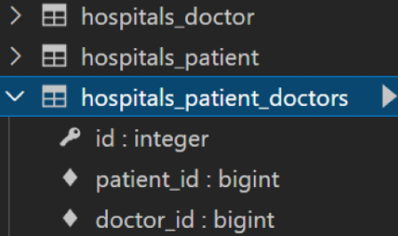

